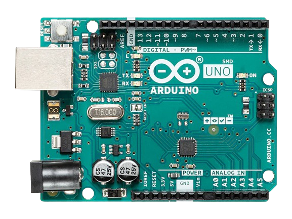
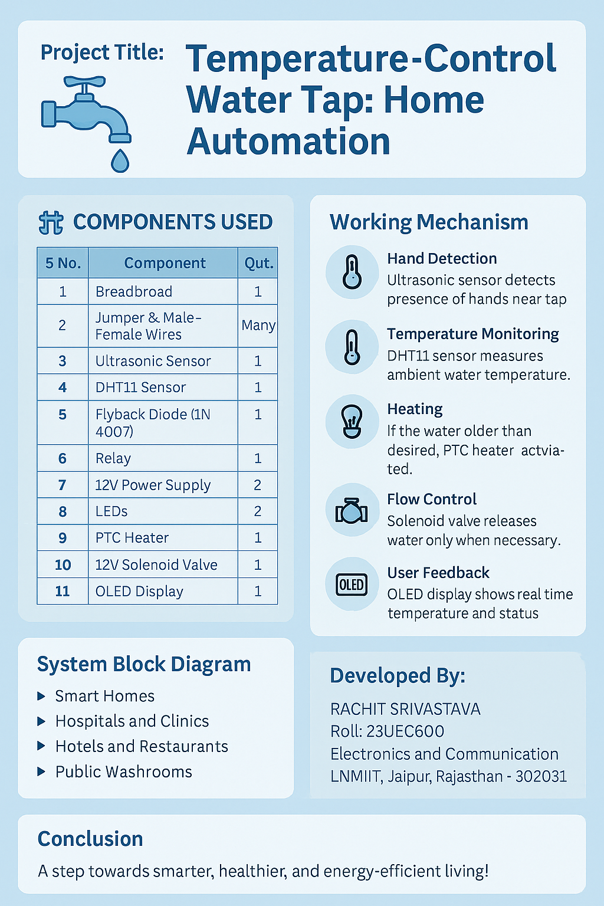

# Automatic Temperature-Controlled Water Heater System
 

 
    
  <h3 align="center">Home Automation | Embedded Control System using Arduino</h3> 
  
 Smart Water Heating & Proximity-Based Tap Automation   
      
    · 
    <a href="https://github.com/rachitsrivastava2114/Automatic_Temperature_Controlled_Water_Heater_System/issues">Report Bug</a> 
    · 
  
 

## Table of Contents

* [Project Overview](#project-overview)
  * [Objectives](#objectives)
  * [System Architecture](#system-architecture)
* [Hardware Components Used](#hardware-components-used)
* [Software & Tools](#software-&-tools)
* [Working Principle](#working-principle)
* [Control Strategy](#control-strategy)
* [Verification & Testing](#verification--testing)
* [Results](#results)
* [Authors](#authors)
* [License](#license)

## Project Overview

This project implements an automatic temperature-controlled water heater system using an Arduino microcontroller. The system measures real-time water temperature using a DHT11 sensor and regulates heating based on a user-defined temperature setpoint through a PI (Proportional-Integral) controller.

An ultrasonic sensor is used to detect hand or object presence, enabling smart tap activation. System parameters such as distance, temperature, setpoint, and estimated time to reach the desired temperature (ETA) are displayed on an OLED display, providing real-time feedback to the user.

The project demonstrates embedded control, sensor interfacing, and closed-loop temperature regulation suitable for smart home and automation applications.   
      

### Objectives

* Design an automatic temperature-controlled water heating system
* Implement PI control for temperature regulation
* Allow user-defined temperature setpoint using a potentiometer
* Detect user presence using an ultrasonic sensor
* Display system parameters on an OLED screen
* Estimate time required to reach the target temperature

### System Architecture

The system is centered around an Arduino microcontroller, which continuously reads temperature data from a DHT11 sensor and compares it with a user-defined setpoint obtained via a potentiometer.

A PI control algorithm computes the required heater output based on the temperature error. Heater control is achieved through a digital output pin connected to a heating element via appropriate driver circuitry.

An ultrasonic sensor detects proximity to simulate smart tap activation, while an OLED display shows distance, current temperature, setpoint, and ETA. An LED provides visual feedback for object detection.

## Hardware Components Used

* Arduino (UNO / Nano / compatible board)
* DHT11 Temperature Sensor
* Ultrasonic Sensor (HC-SR04)
* OLED Display (128×64, SSD1306)
* Potentiometer (Setpoint control)
* LED Indicator
* Heating element with driver circuitry
* Power supply and connecting wires

## Software & Tools

* Arduino IDE
* Embedded C / Arduino Programming
* Adafruit SSD1306 & GFX Libraries
* DHT Sensor Library
* Serial Monitor for debugging

## Working Principle

* The system continuously measures water temperature using the DHT11 sensor
* The user sets the desired temperature using a potentiometer
* A PI controller calculates the heating control action
* The heater turns ON or OFF based on control output
* The ultrasonic sensor detects proximity to enable tap operation
* ETA to reach the setpoint is calculated using the rate of temperature change
* All parameters are displayed on the OLED screen in real time

## Control Strategy

* Proportional-Integral (PI) control is used
* Proportional term reacts to instantaneous temperature error
* Integral term eliminates steady-state error
* Anti-windup logic limits integral accumulation
* Output is constrained to safe operating limits

## Verification & Testing

* Temperature response verified using different setpoints
* PI controller stability tested under varying conditions
* Ultrasonic sensor accuracy validated through distance measurement
* OLED display verified for real-time updates
* Serial monitor used for debugging and performance analysis

## Results

* Water temperature accurately follows the setpoint
* Heater responds correctly to PI control logic
* ETA estimation provides useful feedback
* OLED displays correct real-time system data
* Proximity detection operates reliably

## Authors

**Rachit Srivastava**  
Bachelor of Technology – Electronics & Communication Engineering

## License

This project is developed for academic and educational purposes only.
